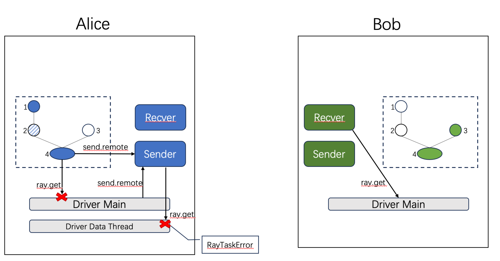
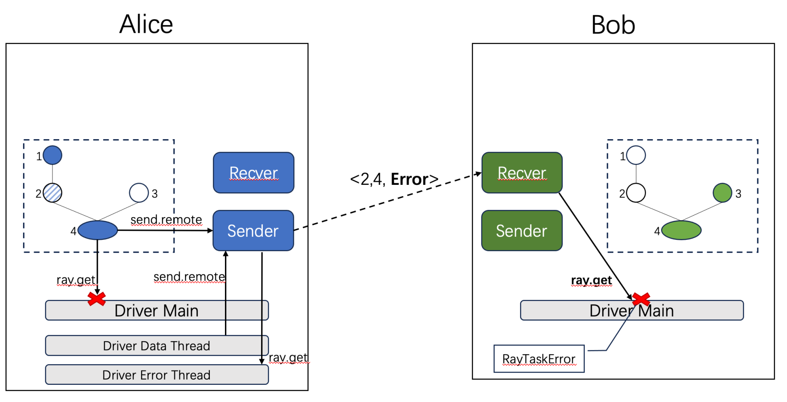
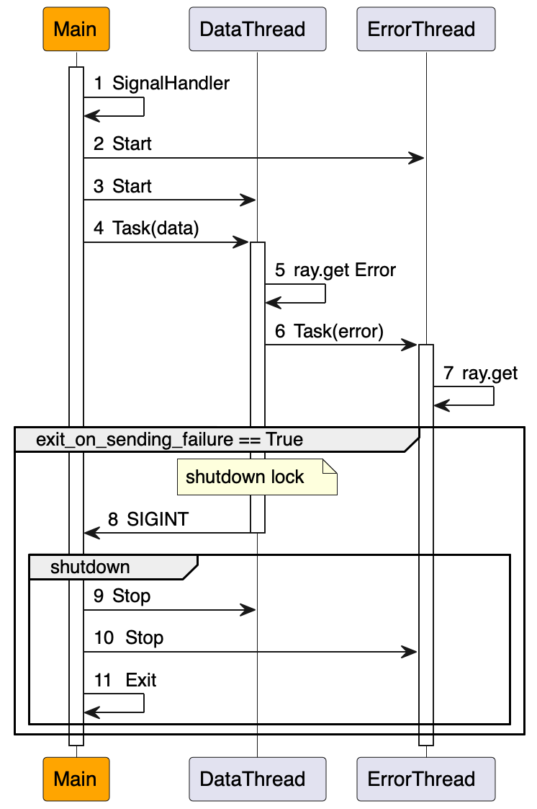
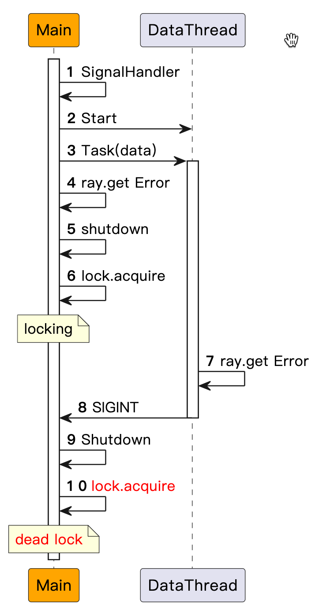

## Summary
### Changelog

#### [2023-09-01]
- Fisrt Version

#### [2024-01-03]
- Update the threading model: main thread is signaled and exit only when exit_on_sending_failure==True.

### General Motivation
Before this proposal, when the execution of a DAG encounters an error in 'alice', below is what will happen:

In alice, both main thread and data sending thread will raise the error, and the process will exit.
In bob,  since it needs the input from 'alice', it waits for 'alice' forever no matter whether 'alice' exists or not.

Therefore, we need a mechanism to inform the other participant(s) when the DAG execution raises error.

## Design and Architecture
The below graph shows what will happen now after this proposal:

In alice, when the data-sending thread finds a RayTaskError indicating an execution failure, it will wrap it as a `FedRemoteError` object and replace the original data object in place to send to bob.
In bob, the main thread will poll data from receiver actor, where it finds out the data is in the type of `FedRemoteError` and re-raises it, and gets an exception just as what happens in "alice".

The threading model in this proposal is shown below:

### The explanation of the `_atomic_shutdown_flag`
When the failure happens, both main thread and data thread get the error and trigger the shutdown, which will execute the "failure handler" twice.  The typical method to ensure the `failure_handler` is executed only once is to set up a flag to check whether it has been executed or not, and wrap it with `threading.lock` because it's a critical section. 

However, this will cause the dead lock as shown in below's graph.
The data thread triggers the shutdown stage by sending `SIGINT`  signal that is implemented by causing `KeyboardInterrupt` error (step 8). In order to handle the exception, OS will hold the context of the current process, including the acquired `threading.lock` in step 6, and change the context to error handler, i.e. the signal handler in step 9. Since the lock has not yet released, acquiring the same lock will cause the dead lock (step 10).

The solution is to check the lock before sending the signal. That lock is the `_atomic_shutdown_flag`.
